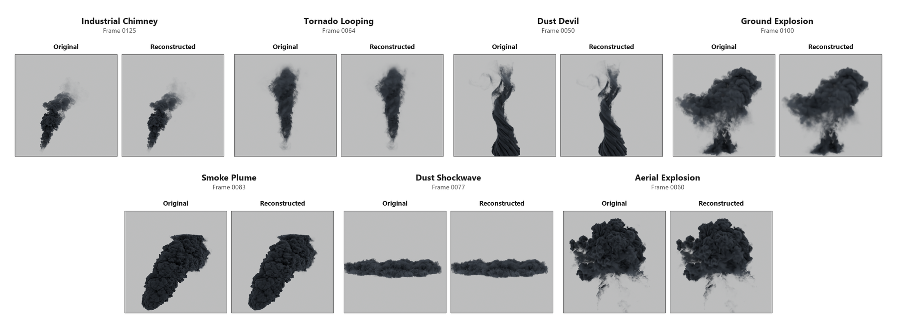
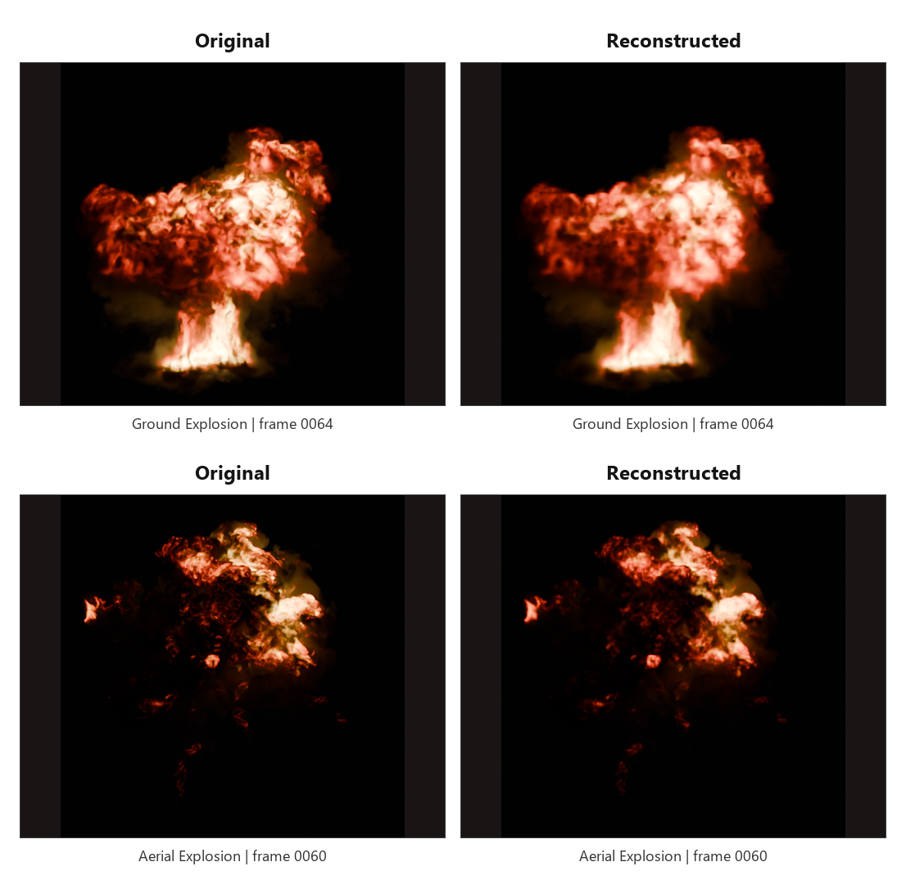
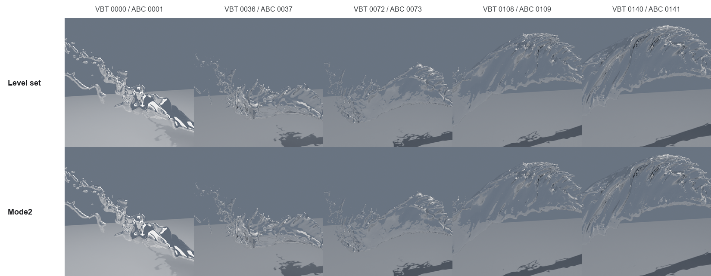
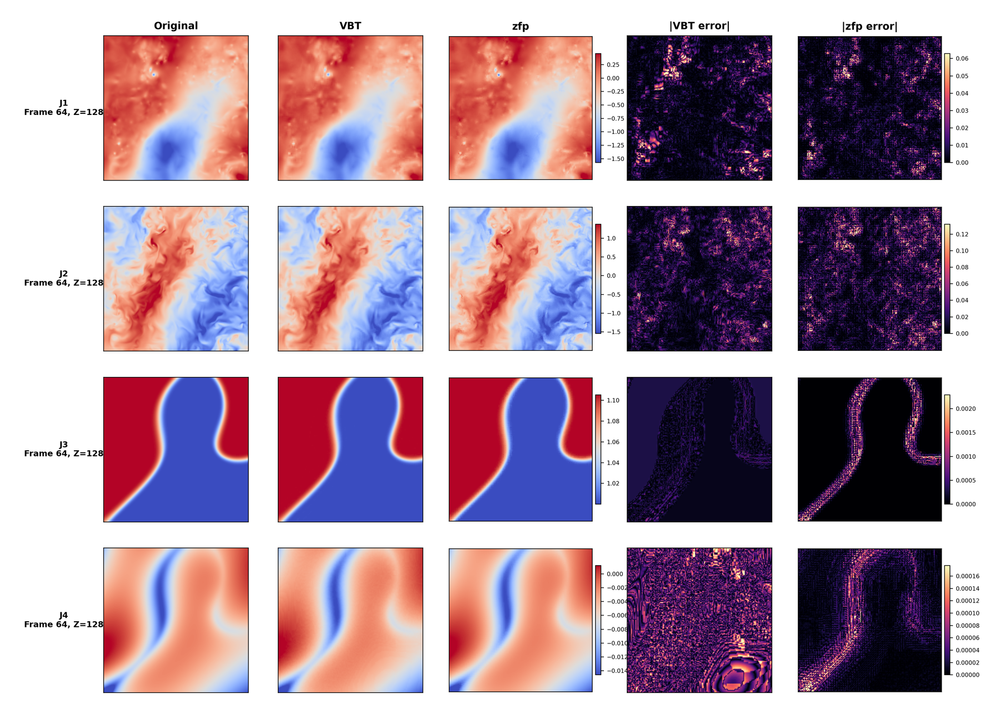

# VBT

VBT is a training-free packed representation for dynamic scalar volumes.
One `VBTPACK4` asset remains directly addressable at `(x, y, z, t)`, so
scientific queries and smoke, fire, and liquid rendering do not require a
dense sequence to be reconstructed first.


## Why VBT

- **One dynamic format, specialized preservation routes.** Scientific fields
  use error-aware Grid4 routing, smoke and fire retain temporal density,
  flames, and temperature controls, and liquid level sets use Mode2
  sign-aware shell residuals.
- **Direct compressed-domain access.** CPU, CUDA, Vulkan, Blender proxy, and
  experimental native Cycles paths address compressed controls without first
  materializing every dense frame.
- **Dynamic rather than single-frame.** Time remains part of the representation;
  VBT Studio provides timeline playback, deterministic frame selection, PNG
  sequences, and MP4 export.
- **No training stage.** Compression is metadata-driven and deterministic. A
  new dataset does not require network training or inference infrastructure.
- **Measured end to end.** The repository includes format tests, frame mapping
  checks, image alignment contracts, GPU timestamp benchmarks, and compact
  cache memory accounting.

| Data route | Preserved signal | Direct consumers |
| --- | --- | --- |
| Scientific Grid4 | bulk accuracy, sparse events, bounded tails | CPU/CUDA query tools, slice analysis |
| Smoke / fire | density, flames, temperature over time | Vulkan, Blender/Cycles bridges |
| Mode2 liquid | `phi=0` topology, thin sheets, droplets, spray | Fast Surface, Physical Water |

## Visual Fidelity

### Seven Smoke Datasets

All original/reconstructed pairs below use the same source frame, camera,
material, resolution, and sample count. The seven VBT assets cover compression
ratios from **25.09x to 178.34x**.



### Fire With Aligned Fields

Physical fire data keeps density and flames aligned; Aerial Explosion also
uses a compressed temperature field. The image comparison is rendered through
the same Cycles contract on each side.



| Dataset | Compressed fields | Field compression | Render PSNR | Render SSIM |
| --- | --- | ---: | ---: | ---: |
| Ground Explosion | density + flames | 178.34x / 219.28x | 27.85 dB | 0.9253 |
| Aerial Explosion | density + flames + temperature | 90.93x / 248.42x / 116.18x | 32.62 dB | 0.9686 |

### Mode2 Dynamic Liquid

Mode2 stores shell residuals around the level-set surface and enforces
sign-aware crossings. This preserves sheets and detached spray while rejecting
the false granular volume box produced by unsupported near-zero samples.



| Profile | Compression | Field PSNR | Compression-only render SSIM | Mode2 Chamfer-L1 | Fast Surface GPU FPS |
| --- | ---: | ---: | ---: | ---: | ---: |
| Quality 0.5 | 46.53x | 52.3393 dB | 0.99496 | 0.000143 | 142.7 |
| Performance 0.75 | 36.26x | 53.4012 dB | 0.99549 | 0.000189 | 213.0 |

The FPS values use the current compact-cache binary at `960 x 550`; they are
GPU timestamp throughput and exclude file loading and PNG encoding.

## VBT Studio

`VBTStudio/` is our Vulkan desktop engine for compressed dynamic volumes. It
opens `.vbtp` assets directly and keeps compressed offsets, payloads, and the
current-frame control cache resident on the GPU.


The engine includes:

- categorized smoke, fire, and fluid asset loading;
- aligned density, flames, and temperature fields;
- Fast Volume, Physical Fire, Fast Surface, and Physical Water modes;
- orbit camera, Y-up/Z-up presentation, and reproducible CLI camera controls;
- timeline seek/play/loop and dynamic frame-cache rebuilds;
- PNG frame, PNG sequence, MP4, and timing CSV export;
- live GPU stage timing, active-leaf counts, cache MiB, and VRAM savings.

| Physical Fire | Physical Water |
| :---: | :---: |
|  |  |

### GPU Current-Frame Cache

A GPU-built active-leaf page table decodes temporal controls once per active
leaf and selected frame. Camera and material changes reuse that cache. The
optimized images are byte-identical to the retained direct-decoder images.


| Workload | Direct decode | Compact cache | Speedup | Cache VRAM saved |
| --- | ---: | ---: | ---: | ---: |
| Industrial smoke | 15.157 ms | 3.051 ms | 4.967x | 72.9% |
| Ground Physical Fire | 75.321 ms | 7.506 ms | 10.035x | 62.1% |
| Aerial Physical Fire | 100.581 ms | 16.916 ms | 5.946x | 67.0% |
| Fluid performance | 67.172 ms | 7.865 ms | 8.541x | 0.0% |
| Fluid quality | 86.722 ms | 14.573 ms | 5.951x | 0.0% |

Mode2 leaves are all active by construction, so liquid profiles retain the
decode speedup but do not claim a false active-leaf memory reduction. Aerial
three-field cache allocation decreases from 1,791.04 MiB to 590.32 MiB.

## Scientific Fields

The scientific path was validated on J1-J8 using corrected RAW axes
`[X,Y,Z,T]` with time fastest. The zfp 4D command receives `(T,Z,Y,X)`. The
plots use the same frame and slice for Original, VBT, zfp, and both error maps.



| Case | Operating point | Size gap vs zfp | VBT MaxAbs | zfp MaxAbs | MaxAbs reduction |
| --- | --- | ---: | ---: | ---: | ---: |
| J1 | near-size | -0.26% | 0.8561 | 1.3822 | 38.1% |
| J2 | near-size | -0.43% | 0.6698 | 1.4436 | 53.6% |
| J3 | zfp minimum-rate | +23.99% | 0.00788 | 0.03002 | 73.8% |
| J4 | zfp minimum-rate | +28.45% | 0.00217 | 0.00401 | 45.9% |
| J5 | near-size | -0.03% | 0.2483 | 0.6235 | 60.2% |
| J6 | near-size | -0.53% | 0.01089 | 0.03275 | 66.8% |
| J7 | near-size | -0.31% | 0.06086 | 0.14488 | 58.0% |
| J8 | near-size | +0.37% | 0.01507 | 0.02901 | 48.1% |

VBT has lower MaxAbs error in all eight cases. J3 and J4 are explicitly marked
as `minimum-rate`: zfp cannot reach the smaller VBT sizes below its 0.25 bpv
4D minimum, so those two rows are not presented as strict same-size matches.

## Public Result Data

The README tables are backed by machine-readable CSV files:

- [Smoke, fire, and fluid compression/quality](docs/results/compression_quality.csv)
- [VBT Studio GPU benchmarks](docs/results/vbtstudio_gpu_benchmarks.csv)
- [J1-J8 VBT versus zfp](docs/results/scientific_zfp_summary.csv)

## Architecture

```text
RAW / VDB / level set + metadata
                  |
                  v
       scientific / render-temporal / Mode2 encoder
                  |
                  v
  VBTPACK4 header + leaf offsets + flat payload pool
       |                 |                 |
       v                 v                 v
 CPU/CUDA queries   VBT Studio Vulkan   Blender/Cycles paths
```

`VBTPACK4` is unchanged by the GPU cache. The cache is a runtime acceleration,
not a second file format or sidecar representation.

## Repository Layout

```text
src/                    encoder, payload, metadata, and CPU decode logic
render/                 Vulkan scientific and smoke sampling tools
tests/                  format, payload, loader, and RAW regression tests
VBTStudio/              dynamic Vulkan desktop renderer
3D/vdb_tools/           RAW/OpenVDB/VBT conversion tools
cycles_native_vbt/      native Cycles loader and sampler prototype
blender_patch/          Blender/Cycles .vbtp integration patch
blender_bridge/         Blender OpenVDB proxy addon
blender_bridge_tools/   compressed preview and VBT-to-VDB tools
scripts/                core data, compression, render, and validation drivers
data/                   local VBT Studio runtime catalog metadata
docs/                   architecture, curated images, and public result CSVs
```

## Build And Test

```powershell
cmake -S . -B build `
  -DBUILD_VBT_RENDER=ON `
  -DVBT_BUILD_CYCLES_NATIVE_STAGING=ON `
  -DVBT_BUILD_BLENDER_BRIDGE_TOOLS=ON
cmake --build build --config Release
ctest --test-dir build -C Release --output-on-failure

cmake -S 3D/vdb_tools -B 3D/vdb_tools/build
cmake --build 3D/vdb_tools/build --config Release
ctest --test-dir 3D/vdb_tools/build -C Release --output-on-failure

cmake -S VBTStudio -B VBTStudio/build
cmake --build VBTStudio/build --config Release
ctest --test-dir VBTStudio/build -C Release --output-on-failure
```

`render/` requires Vulkan and the local zfp source. OpenVDB converters are
built only when OpenVDB is available.

## Run VBT Studio

Open one compressed field:

```powershell
.\VBTStudio\build\frontend\Release\vbtstudio.exe `
  --asset C:\path\to\density.vbtp
```

Render aligned Physical Fire fields:

```powershell
.\VBTStudio\build\frontend\Release\vbtstudio.exe `
  --asset C:\path\to\density.vbtp `
  --field C:\path\to\flames.vbtp `
  --temperature C:\path\to\temperature.vbtp `
  --preset fire_physical
```

Render a Mode2 level set:

```powershell
.\VBTStudio\build\frontend\Release\vbtstudio.exe `
  --asset C:\path\to\water_levelset.vbtp `
  --preset water_studio
```

See [VBTStudio/README.md](VBTStudio/README.md) for camera, timeline, render, and
sequence-export options.

## Blender And Cycles

Two integration paths are retained:

1. `blender_bridge/` and `blender_bridge_tools/` export an OpenVDB proxy for
   standard Blender workflows.
2. `cycles_native_vbt/` and `blender_patch/` implement the experimental direct
   `.vbtp -> Cycles scene sync -> resident device blob -> volume kernel` path
   for CPU and CUDA.

## Data Policy

GitHub contains core source, tests, metadata, documentation, public result
tables, and a small curated image set. Generated builds, `.vbtp`, RAW, VDB,
Alembic/Blender sources, videos, reports, paper workspaces, and full validation
galleries remain local because they are large or reproducible.

See [docs/UPDATE_20260717.md](docs/UPDATE_20260717.md) for the current public
snapshot and [docs/VBT_Studio_Design_20260714.md](docs/VBT_Studio_Design_20260714.md)
for the VBT Studio architecture.
