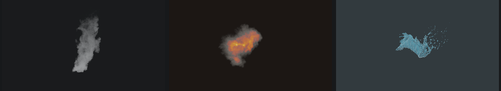
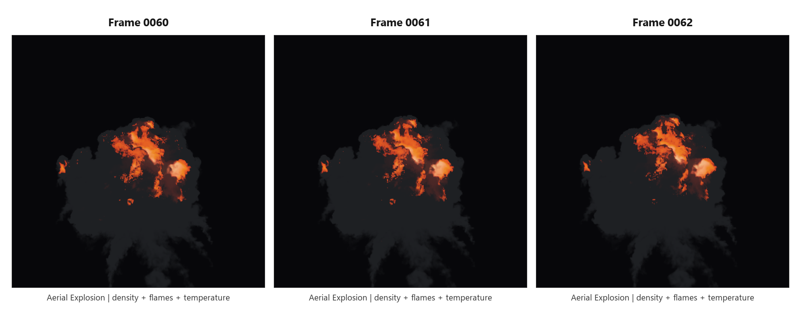
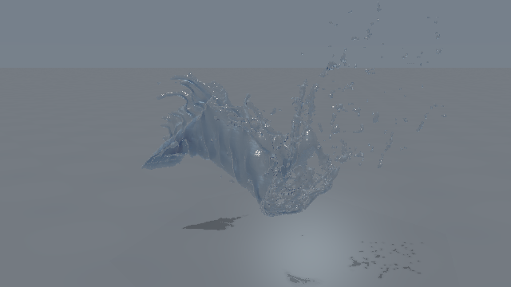

# VBT

VBT is a training-free packed representation for time-varying scalar volumes.
Compressed `.vbtp` assets remain directly addressable at `(x, y, z, t)`,
supporting scientific queries and interactive smoke, fire, and liquid rendering
without reconstructing a dense sequence first.



## Highlights

- One `VBTPACK4` container for scientific fields, smoke/fire density fields,
  and liquid level sets.
- Direct random access to compressed spatial and temporal controls.
- Existing smoke/fire routes preserved alongside Mode2 liquid reconstruction.
- Sign-aware `phi=0` protection for thin liquid sheets, droplets, and splashes.
- Native Vulkan playback in VBT Studio with timeline, materials, camera control,
  PNG sequences, and MP4 export.
- Physical Fire and Physical Water material modes.
- Blender OpenVDB proxy tools and an experimental native Cycles `.vbtp` path.
- GPU current-frame decoding cache with a compact active-leaf page table.

## Results

### Dynamic Physical Fire

Density, flames, and temperature are aligned and sampled directly from three
compressed VBT fields.



### Mode2 Physical Water

The liquid renderer traces supported level-set sign crossings and preserves
detached spray while rejecting false near-zero bounding-box artifacts.



Representative validated performance at the retained render contracts:

| Workload | Direct sampling | Compact cache | Speedup |
| --- | ---: | ---: | ---: |
| Industrial smoke | 15.157 ms | 3.051 ms | 4.967x |
| Ground Physical Fire | 75.321 ms | 7.506 ms | 10.035x |
| Aerial Physical Fire | 100.581 ms | 16.916 ms | 5.946x |
| Fluid performance | 67.172 ms | 7.865 ms | 8.541x |
| Fluid quality | 86.722 ms | 14.573 ms | 5.951x |

The Aerial three-field cache drops from 1,791.04 MiB to 590.32 MiB. Frames
60-62 render at 47.87-52.67 FPS at 640 x 640, including frame-cache rebuilds.

## Repository Layout

```text
src/                    encoder, payload, metadata, and CPU decode logic
render/                 Vulkan scientific and smoke sampling tools
tests/                  format, payload, loader, and RAW regression tests
VBTStudio/              dynamic Vulkan desktop renderer
3D/vdb_tools/           RAW/OpenVDB/VBT conversion tools
cycles_native_vbt/      native Cycles loader and sampler prototype
blender_patch/          Blender/Cycles .vbtp integration patch
blender_bridge/         Blender OpenVDB proxy addon
blender_bridge_tools/   compressed preview and VBT-to-VDB tools
scripts/                core data, compression, render, and validation drivers
data/                   local VBT Studio runtime catalog metadata
docs/                   architecture notes and curated images
```

## Representation

`VBTPACK4` stores a header, block-offset table, and flat payload pool.

- Scientific fields use a Grid4 coarse base with adaptive coarse retention,
  sparse events, dense-grid candidates, and tail-aware rate-distortion routing.
- Smoke and fire use the render-temporal frontend with temporal keyframes and
  spatially routed density, flames, and temperature payloads.
- Liquid metadata selects the Mode2 surface-preserving route with sign-aware
  residual protection around `phi = 0`.

## Build And Test

```powershell
cmake -S . -B build `
  -DBUILD_VBT_RENDER=ON `
  -DVBT_BUILD_CYCLES_NATIVE_STAGING=ON `
  -DVBT_BUILD_BLENDER_BRIDGE_TOOLS=ON
cmake --build build --config Release
ctest --test-dir build -C Release --output-on-failure

cmake -S 3D/vdb_tools -B 3D/vdb_tools/build
cmake --build 3D/vdb_tools/build --config Release
ctest --test-dir 3D/vdb_tools/build -C Release --output-on-failure

cmake -S VBTStudio -B VBTStudio/build
cmake --build VBTStudio/build --config Release
ctest --test-dir VBTStudio/build -C Release --output-on-failure
```

`render/` requires Vulkan and the local zfp source. OpenVDB converters are
built only when OpenVDB is available.

## Compress A Volume

```powershell
.\build\Release\vbt_spatialfirst_probe.exe `
  --input-raw C:\path\to\volume.raw `
  --metadata C:\path\to\volume.metadata.json `
  --profile density `
  --sample-step 8 `
  --save-vbt C:\path\to\volume.vbtp
```

For liquid level sets, use the metadata-driven liquid profile so the encoder
selects the Mode2 surface route.

## VBT Studio

```powershell
.\VBTStudio\build\frontend\Release\vbtstudio.exe `
  --asset C:\path\to\density.vbtp
```

Physical Fire accepts density, flames, and optional temperature fields:

```powershell
.\VBTStudio\build\frontend\Release\vbtstudio.exe `
  --asset C:\path\to\density.vbtp `
  --field C:\path\to\flames.vbtp `
  --temperature C:\path\to\temperature.vbtp `
  --preset fire_physical
```

Physical Water opens a Mode2 level set directly:

```powershell
.\VBTStudio\build\frontend\Release\vbtstudio.exe `
  --asset C:\path\to\water_levelset.vbtp `
  --preset water_studio
```

See [VBTStudio/README.md](VBTStudio/README.md) for render and sequence-export
options.

## Blender And Cycles

Two integration paths are retained:

1. `blender_bridge/` and `blender_bridge_tools/` export an OpenVDB proxy for
   standard Blender workflows.
2. `cycles_native_vbt/` and `blender_patch/` implement the experimental
   direct `.vbtp -> Cycles scene sync -> resident device blob -> volume kernel`
   path for CPU and CUDA.

## Data Policy

The repository contains the core source, tests, metadata, documentation, and a
small curated image set. Generated builds, compressed datasets, RAW/VDB files,
Alembic/Blender sources, videos, reports, paper workspaces, and validation
galleries remain local and are excluded from Git.

See [docs/UPDATE_20260716.md](docs/UPDATE_20260716.md) for the latest technical
changes and [docs/VBT_Studio_Design_20260714.md](docs/VBT_Studio_Design_20260714.md)
for the VBT Studio architecture.
