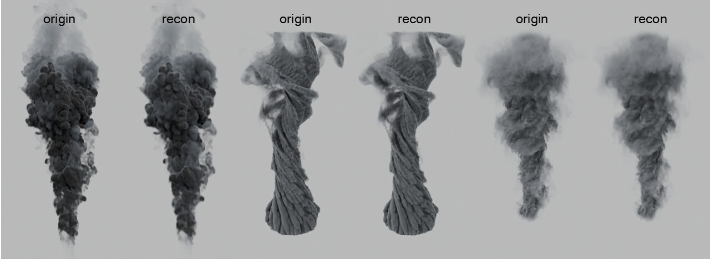

# VBT Mainline

<p align="center">
  <a href="#english"></a>
  <a href="#中文"></a>
  <a href="./assets/paper/VBT.pdf"></a>
</p>

<p align="center">
  <a href="./assets/paper/VBT.pdf">
    
  </a>
</p>

<p align="center">
  Render-facing compressed 4D volume backend for smoke and fire, with a shared packed layout that also supports scientific fields.
</p>

---

<a id="english"></a>
## English

### What This Repository Is

`VBT Mainline` is the trimmed code release of our VBT system for time-varying volumetric data.

The project is built around one central goal:

- keep animated volumetric assets compressed
- keep them directly addressable after compression
- make the compressed asset itself the runtime object

Instead of treating compression as a purely offline archival step, VBT treats the compressed 4D asset as something that can still be:

- sampled at `(x, y, z, t)`
- queried on CPU or GPU
- used in renderer-side workflows
- bridged into Blender
- integrated into a native Cycles prototype path

The current repository is intentionally focused on the mainline code paths rather than the full paper workspace, benchmark dumps, and figure-generation scripts.

### Project Focus

The current paper narrative is render-first.

For rendering workloads such as smoke and fire, the main question is not only rate-distortion quality. The more important systems question is whether an animated volume sequence can remain:

- compact in storage
- resident across frames
- directly sampleable in the renderer
- usable for preview and inspection without materializing a dense frame cache

That is the main claim of this repository.

The scientific frontend is still included because it exercises the same packed 4D backend, file format, block table, and query path, but the storytelling priority is the renderer-facing asset path.

### Important Scope Clarification

This repository contains two different GPU-facing paths:

1. `render/` is the standalone GPU query and benchmark path.
   It is Vulkan-based and is mainly used for direct `(x, y, z, t)` queries, dense-vs-VBT comparisons, and scientific-style throughput measurements.

2. `cycles_native_vbt/` plus `blender_patch/` is the renderer end-to-end path.
   This is the native Cycles prototype, targeting CPU and CUDA inside Blender/Cycles. A `.vbtp` asset is loaded as a resident blob and sampled directly in the Cycles volume kernel.

So if you only inspect the standalone build targets, you will mostly see Vulkan first. The CUDA path is present, but it lives inside the patched Blender/Cycles integration rather than as a separate CUDA demo executable in this repository.

### Core Idea

VBT uses a packed `VBTPACK4` layout with:

- a file header
- a global offset table
- a flat payload pool

On top of this shared physical layout, the repository contains two frontends:

1. A scientific frontend for dense scalar fields
2. A render-oriented frontend for smoke/fire density sequences

The render path is temporal-first. It is designed to preserve temporally localized visible events that would otherwise be blurred away by a purely spatial-first approximation. In practice this means the compressed asset is organized for direct runtime sampling, not just offline decompression.

### What Is Included

- `src/`
  Core encoder/decoder backend and the main CLI.
- `render/`
  GPU query benchmark, scientific frame export, and smoke probe utilities.
- `cycles_native_vbt/`
  Native Cycles staging code: standalone VBT sampler, blob packer, loader, and Blender scene scripts.
- `blender_bridge/`
  Blender addon for loading a `.vbtp` frame through a cached OpenVDB proxy.
- `blender_bridge_tools/`
  Optional helper tools for proxy export and direct compressed preview.
- `blender_patch/`
  Patch material for the Blender/Cycles fork used by the native path.

### Main Workflows

#### 1. Scientific Compression

Compress a dense scientific field to `VBTPACK4`:

```powershell
.\build\Release\vbt_spatialfirst_probe.exe `
  --input-raw C:\path\to\J2.raw `
  --profile generic `
  --sample-step 8 `
  --generic-adaptive-coarse-keep `
  --generic-dense-crossover `
  --generic-dense-grid-res 4 `
  --generic-dense-bits 4 `
  --full-eval `
  --save-vbt C:\path\to\J2.vbtp
```

Export one reconstructed frame:

```powershell
.\build\Release\vbt_export_scientific_frame.exe `
  --input-vbt C:\path\to\J2.vbtp `
  --frame 64 `
  --output-raw C:\path\to\J2_frame64.raw
```

#### 2. Render-Oriented Compression

Compress a smoke/fire sequence to a render-facing `.vbtp` asset:

```powershell
.\build\Release\vbt_spatialfirst_probe.exe `
  --input-raw C:\path\to\smoke.raw `
  --metadata C:\path\to\smoke.metadata.json `
  --profile density `
  --sample-step 8 `
  --save-vbt C:\path\to\smoke.vbtp
```

Generate a smoke-ray packet summary for downstream rendering tests:

```powershell
.\build\Release\vbt_render_smoke_probe.exe `
  --input-vbt C:\path\to\smoke.vbtp `
  --metadata C:\path\to\smoke.metadata.json `
  --frame 100 `
  --output-rays C:\path\to\rays.bin `
  --output-summary C:\path\to\probe_summary.json
```

#### 3. GPU Query Benchmark

If Vulkan is available:

```powershell
.\build\Release\vbt_query_bench.exe `
  --input-vbt C:\path\to\J2.vbtp `
  --batch-size 65536 `
  --pattern random `
  --bench-mode compare
```

### Blender Integration

#### Native Cycles Staging

`cycles_native_vbt/` contains the native `.vbtp` path prototype. The intended contract is:

```text
.vbtp asset -> Blender Volume object -> Cycles scene sync -> device buffers -> Cycles volume kernel sampler
```

This is the actual renderer end-to-end path. In the current codebase, the native prototype is scoped to CPU and CUDA backends inside Cycles. The CUDA logic is embedded into the patched Cycles runtime, not exposed as a standalone CUDA benchmark binary here.

Build the host-side sampler probe:

```powershell
cmake --build build --config Release --target vbt_sampler_cpu_probe
```

Create a minimal native-VBT Blender scene:

```powershell
blender --background --python cycles_native_vbt/create_native_vbt_scene.py -- `
  --input-vbt C:\path\to\smoke.vbtp `
  --frame 100 `
  --output-blend C:\path\to\native_vbt_test.blend
```

#### Blender Proxy Bridge

`blender_bridge/` is the fallback path. It converts one `.vbtp` frame to a cached `.vdb` proxy for standard Blender import, and can also invoke a direct compressed preview tool.

If `OpenVDB` is available:

```powershell
cmake -S . -B build -DVBT_BUILD_BLENDER_BRIDGE_TOOLS=ON
cmake --build build --config Release --target render_temporal_vbt_to_vdb render_temporal_vbt_direct_preview
```

### Build

Minimal build:

```powershell
cmake -S . -B build
cmake --build build --config Release
```

Optional dependencies:

- `OpenMP`: enabled automatically when available
- `Vulkan SDK + glslc`: required for `vbt_query_bench`
- patched Blender/Cycles source tree: required for the native CPU/CUDA end-to-end rendering path
- `OpenVDB`: only required for `render_temporal_vbt_to_vdb`

If you only want the encoder and native Cycles staging probe:

```powershell
cmake -S . -B build -DVBT_BUILD_RENDER_TOOLS=OFF -DVBT_BUILD_BLENDER_BRIDGE_TOOLS=OFF
cmake --build build --config Release
```

### Paper

- PDF: [VBT.pdf](./assets/paper/VBT.pdf)

The paper describes the packed 4D backend, the scientific and rendering frontends, the renderer-facing runtime contract, and the Blender/Cycles integration direction in more detail.

---

<a id="中文"></a>
## 中文

### 这个仓库是做什么的

`VBT Mainline` 是我们面向时变体数据的 VBT 系统精简主线代码仓库。

它解决的不是“把数据压小”这么简单，而是下面这个更核心的运行时问题：

- 动画体数据能不能在压缩后仍然保持可查询
- 能不能把压缩资产本身作为运行时对象
- 能不能不先解成逐帧 dense cache 就直接进入渲染和检查流程

也就是说，VBT 不是只把体数据当作离线归档文件，而是把压缩后的 4D 资产继续当作：

- `(x, y, z, t)` 可直接采样的对象
- CPU / GPU 可查询对象
- 渲染器可接入对象
- Blender 可桥接对象
- Cycles 原生采样路径的候选运行时表示

### 当前主线

当前主线是渲染优先，不再以科学场压缩指标作为唯一叙事中心。

对于烟雾、火焰这类渲染场景，关键问题不是单纯的离线率失真最优，而是动画体序列能否同时满足：

- 存储紧凑
- 跨帧常驻
- 直接采样
- 支持预览和探针查询
- 不依赖逐帧 VDB 或 dense 上传

这也是这个仓库真正想表达的系统价值。

科学场前端仍然保留，因为它和渲染场共享同一个 packed 4D backend、offset table、payload pool 和查询骨架，但仓库的主叙事已经切换到 renderer-facing asset contract。

### 需要特别说明的一点

这个仓库里其实有两条不同的 GPU 路径，不应该混在一起理解：

1. `render/` 是独立 GPU 查询和 benchmark 路径。
   它基于 Vulkan，主要用于直接 `(x, y, z, t)` 查询、Dense 与 VBT 对比，以及更偏科学场风格的吞吐测试。

2. `cycles_native_vbt/` 加 `blender_patch/` 才是渲染端到端路径。
   这部分是原生 Cycles 原型，目标后端是 Blender/Cycles 内部的 CPU 和 CUDA。`.vbtp` 会作为常驻 blob 被加载，并直接在 Cycles 的 volume kernel 里完成采样。

所以如果只看这个仓库里单独可编译的工具，最先看到的大多会是 Vulkan。真正的 CUDA 路径是存在的，但它藏在补丁后的 Blender/Cycles 运行时里，而不是这里单独放一个 CUDA demo 可执行文件。

### 核心思想

VBT 使用统一的 `VBTPACK4` 落盘布局：

- file header
- global offset table
- flat payload pool

在这个统一物理布局上，仓库里保留了两个前端：

1. 科学场前端
2. 面向烟雾/火焰的渲染场前端

其中渲染场采用时间优先组织方式，目标是保留那些在少数帧内发生、但对视觉边界和体渲染结果很敏感的时间事件。换句话说，这套设计更强调“压缩后还能直接拿来采样和渲染”，而不是只强调“解压后误差多小”。

### 仓库包含哪些内容

- `src/`
  主编码/解码后端和统一 CLI。
- `render/`
  GPU 查询 benchmark、科学场帧导出、烟雾采样探针工具。
- `cycles_native_vbt/`
  原生 Cycles 路径原型，包括 standalone sampler、blob packer、loader 和 Blender 脚本。
- `blender_bridge/`
  通过 OpenVDB proxy 导入单帧 `.vbtp` 的 Blender 插件。
- `blender_bridge_tools/`
  proxy 导出和压缩态预览的辅助工具。
- `blender_patch/`
  原生 Cycles 接入所需的 Blender/Cycles 补丁。

### 主流程

#### 1. 科学场压缩

```powershell
.\build\Release\vbt_spatialfirst_probe.exe `
  --input-raw C:\path\to\J2.raw `
  --profile generic `
  --sample-step 8 `
  --generic-adaptive-coarse-keep `
  --generic-dense-crossover `
  --generic-dense-grid-res 4 `
  --generic-dense-bits 4 `
  --full-eval `
  --save-vbt C:\path\to\J2.vbtp
```

导出某一帧重建结果：

```powershell
.\build\Release\vbt_export_scientific_frame.exe `
  --input-vbt C:\path\to\J2.vbtp `
  --frame 64 `
  --output-raw C:\path\to\J2_frame64.raw
```

#### 2. 渲染场压缩

```powershell
.\build\Release\vbt_spatialfirst_probe.exe `
  --input-raw C:\path\to\smoke.raw `
  --metadata C:\path\to\smoke.metadata.json `
  --profile density `
  --sample-step 8 `
  --save-vbt C:\path\to\smoke.vbtp
```

生成后续渲染测试使用的烟雾射线包摘要：

```powershell
.\build\Release\vbt_render_smoke_probe.exe `
  --input-vbt C:\path\to\smoke.vbtp `
  --metadata C:\path\to\smoke.metadata.json `
  --frame 100 `
  --output-rays C:\path\to\rays.bin `
  --output-summary C:\path\to\probe_summary.json
```

#### 3. GPU 查询基准

如果有 Vulkan：

```powershell
.\build\Release\vbt_query_bench.exe `
  --input-vbt C:\path\to\J2.vbtp `
  --batch-size 65536 `
  --pattern random `
  --bench-mode compare
```

### Blender 接入

#### 原生 Cycles 路径原型

`cycles_native_vbt/` 里的目标是让 `.vbtp` 直接成为 Cycles 可采样资产：

```text
.vbtp asset -> Blender Volume object -> Cycles scene sync -> device buffers -> Cycles volume kernel sampler
```

这条路径才是项目里的渲染端到端链路。当前代码里，原生路径的目标范围是 Cycles 的 CPU 和 CUDA 后端。也就是说，CUDA 逻辑并不是这里单独一个 benchmark 程序，而是嵌在补丁后的 Cycles 运行时内部。

构建 host 侧采样 probe：

```powershell
cmake --build build --config Release --target vbt_sampler_cpu_probe
```

生成一个最小 native-VBT Blender 场景：

```powershell
blender --background --python cycles_native_vbt/create_native_vbt_scene.py -- `
  --input-vbt C:\path\to\smoke.vbtp `
  --frame 100 `
  --output-blend C:\path\to\native_vbt_test.blend
```

#### Blender Proxy Bridge

`blender_bridge/` 是备用路径。它会把单帧 `.vbtp` 转成缓存 `.vdb`，方便用标准 Blender 体数据导入流程查看，同时也支持直接压缩态预览工具。

如果本机有 `OpenVDB`：

```powershell
cmake -S . -B build -DVBT_BUILD_BLENDER_BRIDGE_TOOLS=ON
cmake --build build --config Release --target render_temporal_vbt_to_vdb render_temporal_vbt_direct_preview
```

### 构建方式

基础构建：

```powershell
cmake -S . -B build
cmake --build build --config Release
```

可选依赖：

- `OpenMP`：自动启用并行
- `Vulkan SDK + glslc`：用于 `vbt_query_bench`
- 打过补丁的 Blender/Cycles 源码：用于原生 CPU/CUDA 端到端渲染路径
- `OpenVDB`：仅 `render_temporal_vbt_to_vdb` 需要

如果只想保留主编码器和原生 Cycles probe：

```powershell
cmake -S . -B build -DVBT_BUILD_RENDER_TOOLS=OFF -DVBT_BUILD_BLENDER_BRIDGE_TOOLS=OFF
cmake --build build --config Release
```

### 论文

- PDF: [VBT.pdf](./assets/paper/VBT.pdf)

论文里更完整地描述了 packed 4D backend、科学场/渲染场双前端、renderer-facing runtime contract，以及 Blender/Cycles 接入方向。
