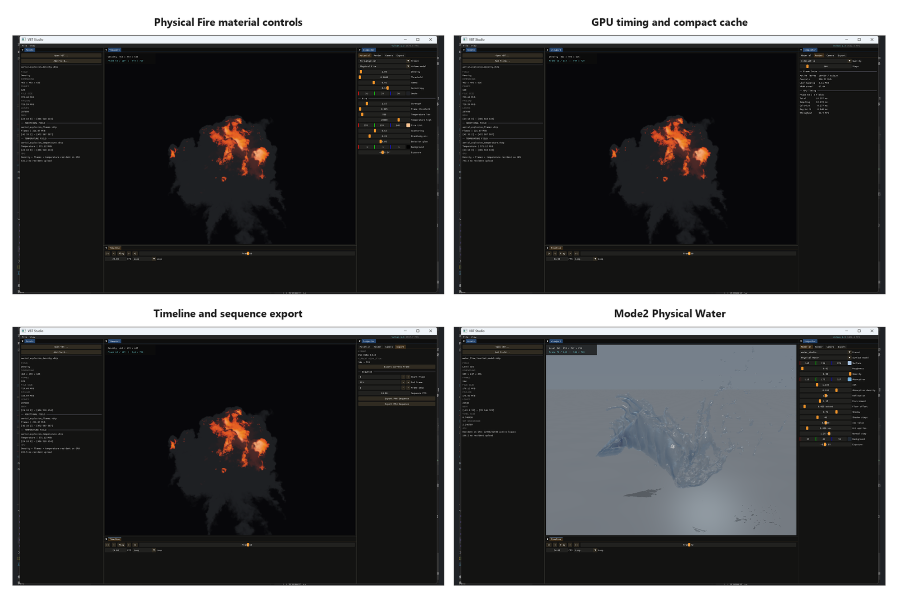
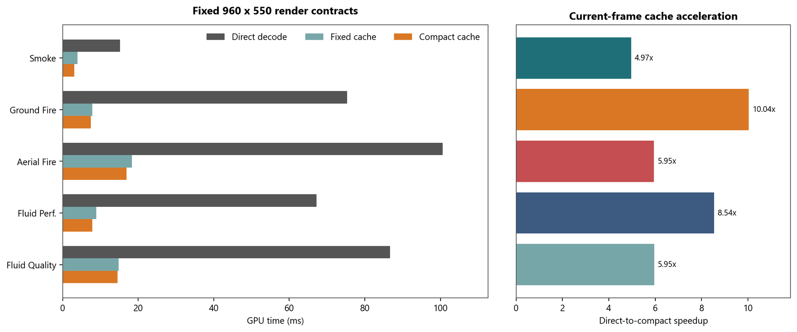

# VBT Studio

VBT Studio is the Vulkan desktop renderer for dynamic `VBTPACK4` assets. It
opens compressed density, flames, temperature, and Mode2 level-set fields
directly without converting every frame to VDB.



## Architecture

```text
backend/   asset inspection, timeline, materials, render/export services
frontend/  GLFW + Vulkan + Dear ImGui desktop application
tests/     backend contract tests
```

The frontend and backend are separate CMake targets in one process. This keeps
the API boundary explicit without copying multi-gigabyte VBT payloads through
IPC. `VBT_SOURCE_DIR` defaults to the parent repository.

The interface exposes the loaded asset and aligned fields, dynamic viewport
and timeline, material/camera controls, GPU timings, compact-cache memory, and
deterministic frame/sequence export in one desktop engine.

## Features

- native Windows VBT file picker and categorized runtime catalog;
- play, loop, ping-pong, frame selection, and deterministic batch frames;
- orbit camera, Y-up/Z-up presentation, and reproducible camera presets;
- current-frame PNG, PNG sequence, timing CSV, and optional MP4 export;
- Fast Volume and Physical Fire rendering;
- Fast Surface and Physical Water rendering;
- aligned density + flames + temperature multi-field sampling;
- direct Mode2 shell-residual decode and `phi=0` surface tracing;
- GPU stage timing, active-leaf counts, cache memory, and VRAM reporting.

Physical Fire performs ordered front-to-back Beer-Lambert extinction, smoke
scattering, HDR flame emission, optional temperature color, glow, and ACES tone
mapping. Physical Water adds entry/exit thickness, IOR reflection/refraction,
absorption, studio lighting, a ground plane, and VBT shadow rays.

## GPU Runtime

Compressed offsets and payloads are uploaded once to device-local buffers.
A current-frame control cache decodes temporal keyframes once per non-empty leaf
and source frame. Camera and material changes reuse the cache; timeline changes
rebuild it.

A GPU-built active-leaf page table allocates full-float controls only for
non-Mode0 leaves. The compact path produces byte-identical images to direct
sampling while measuring 4.967x-10.035x speedups across the retained smoke,
fire, and fluid contracts.



Level-set surface and shadow hits require a supported sign crossing with
negative-side interior evidence. This rejects isolated coarse near-zero samples
that previously appeared as a granular volume box, while preserving real thin
sheets and detached droplets.

## Build

```powershell
cmake -S VBTStudio -B VBTStudio/build -G "Visual Studio 17 2022" -A x64 `
  -DVBT_SOURCE_DIR=C:\path\to\VBT
cmake --build VBTStudio/build --config Release
ctest --test-dir VBTStudio/build -C Release --output-on-failure
```

## Run

Open one compressed field:

```powershell
.\VBTStudio\build\frontend\Release\vbtstudio.exe `
  --asset C:\path\to\volume.vbtp
```

Render Physical Fire from aligned compressed fields:

```powershell
.\VBTStudio\build\frontend\Release\vbtstudio.exe `
  --asset C:\path\to\density.vbtp `
  --field C:\path\to\flames.vbtp `
  --temperature C:\path\to\temperature.vbtp `
  --preset fire_physical `
  --frame 60
```

Render Physical Water:

```powershell
.\VBTStudio\build\frontend\Release\vbtstudio.exe `
  --asset C:\path\to\water_levelset.vbtp `
  --preset water_studio `
  --frame 72
```

## Export

Export an aligned sequence and timing CSV:

```powershell
.\VBTStudio\build\frontend\Release\vbtstudio.exe `
  --asset C:\path\to\density.vbtp `
  --field C:\path\to\flames.vbtp `
  --start-frame 60 --end-frame 90 --frame-step 1 `
  --sequence-fps 24 --render-width 960 --render-height 550 `
  --export-sequence C:\path\to\frames
```

Add `--export-video C:\path\to\sequence.mp4` for H.264 output through
FFmpeg. Use `--timing-csv` to override the CSV path and `--ffmpeg` to select
a specific executable.

For deterministic automation or documentation capture, use
`--inspector-tab material|render|camera|export` to select the initial Inspector
panel.

## Runtime Data

The file picker opens `../data` by default. Runtime `.vbtp` files and their
source datasets are intentionally not versioned; see `../data/README.md` for
the local catalog layout.
